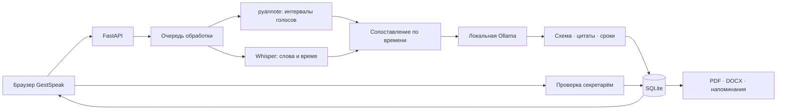

# GestSpeak

**Обсудили. Зафиксировали. Выполнили.**

Локальный ассистент совещаний для кейса **Самрук-Казына**: запись или транскрипт → саммари → поручения с ответственными и сроками → проверка → контроль исполнения. Русский, қазақша и смешанная речь. Аудио и текст обрабатываются внутри вашего контура.

Главная идея — **проверяемое поручение**. Рядом с действием сохраняются исходные реплики, цитата и произнесённый срок. Секретарь видит, откуда появился результат, и подтверждает его перед исполнением.

[Запустить](#быстрый-запуск) · [Демонстрация за 3 минуты](docs/DEMO.md) · [API](docs/API.md) · [Проверки](docs/VALIDATION.md) · [Безопасность](docs/SECURITY.md)

## Быстрый запуск

**Нужно:** Node.js 22.13+, npm, Python 3.9+; для полного AI-контура рекомендуется **Python 3.11**. Установка зависимостей требует интернета. Само приложение обслуживает интерфейс и API с одного адреса.

```bash
git clone https://github.com/BAITC-Hacks/hack-a7c30eea-gestspeak.git
cd hack-a7c30eea-gestspeak
bash scripts/setup.sh
bash scripts/start-local.sh
```

Откройте **http://127.0.0.1:8000**. Интерактивная документация API: **http://127.0.0.1:8000/docs**.

Для выбора Python при первой установке: `GESTSPEAK_PYTHON=python3.11 bash scripts/setup.sh`. Повторный запуск — только `bash scripts/start-local.sh`. Данные и статусы сохраняются в `data/`; скрипты не удаляют их. Если порт занят уже работающей копией, откройте её адрес.

### Первый сценарий

1. Откройте **«Новое совещание» → «Текст»**, выберите тестовый разговор RU, подтвердите уведомление участников и нажмите **«Сформировать протокол»**. Это новый анализ через API. KK и mixed позволяют проверить ещё два примера.
2. Откройте поручение аудита датчиков: посмотрите исходные реплики и окончательный срок **15 октября** после обсуждения двух и трёх недель. Для быстрого обзора интерфейса также доступен **«Открыть демопример»** с заранее размеченными десятью поручениями.
3. Проверьте исполнителя и срок, подтвердите поручение. Измените статус на **«В работе»**.
4. Откройте реестр поручений и напоминания. Скачайте **PDF** или **DOCX**.
5. Создайте новое совещание из [казахского](examples/kazakh.txt) или [смешанного](examples/mixed.txt) текста. Дату задайте явно: от неё рассчитываются относительные сроки.

**Демо размечено заранее** и помечено в интерфейсе и экспортах. Его дата 23.09.2026 — выбранная база относительных сроков, поскольку исходный кейс не задаёт дату заседания. Демопример показывает рабочий процесс; он не является доказательством качества распознавания.

## Что работает

| Возможность | Реализация и границы |
|---|---|
| Интерфейс | Совещания, транскрипт, саммари, поручения, реестр, фильтры, редактирование и проверка |
| Аудио и видео | WAV, MP3, M4A, MP4, WEBM, OGG, FLAC, MOV; до 250 МБ, до 2 часов; локальные веса нужны заранее |
| Запись микрофона | На localhost или HTTPS; обработка после остановки записи |
| RU / KK / mixed | Локальный мультиязычный faster-whisper; выбранный размер модели влияет на качество |
| Диаризация | Локальная pyannote community-1 либо облегчённая ONNX-конфигурация sherpa; голосовые интервалы сопоставляются словам по времени |
| Имена участников | Ручное сопоставление голосового кластера с человеком; говорящий и исполнитель поручения — отдельные сущности |
| Поручения и саммари | Локальная Ollama / Qwen2.5; структурированный ответ, проверка цитат, пересчёт сроков |
| Работа без LLM | Ограниченные локальные правила RU/KK/mixed: явные поручения, обращения, уточнения сроков и выдержки из реплик; режим виден пользователю |
| Контроль сроков | Статусы, сроки, ответственные; внутренние напоминания за 3 дня и при просрочке |
| Документы | PDF со встроенным шрифтом Noto Sans, DOCX, JSON; кириллица и казахские символы |
| Хранение | SQLite, локальные аудиофайлы, журнал событий, удаление встречи |
| Приватность | Запрет публичного LLM endpoint, локальные веса, отключённая телеметрия, изолированная сеть Docker |

**Для полного аудиосценария необходимо подготовить модели и проверить их на вашем оборудовании.** Наличие адаптера не означает измеренного качества RU/KK. Без моделей приложение не отправляет запись в облако и не подставляет деморезультат. Актуальное состояние компонентов доступно в **«Система»** и `/api/health`.

Бот-участник Teams/Zoom/Google Meet, потоковая транскрипция, рассылка email, промышленная СЭД, SSO/RBAC и биометрическая идентификация не реализованы. Записи из этих платформ можно загрузить как файлы.

## Локальные модели

Используются открытые проекты [faster-whisper](https://github.com/SYSTRAN/faster-whisper), [pyannote.audio](https://github.com/pyannote/pyannote-audio), [Ollama](https://github.com/ollama/ollama) и [Qwen2.5](https://ollama.com/library/qwen2.5). Внешние облачные AI API, в том числе NVIDIA hosted API, противоречат ограничению кейса; NVIDIA GPU можно использовать **локально**.

### Облегчённый CPU-профиль

Для проверки полного пути аудио на обычном ноутбуке доступна конфигурация **Whisper tiny + sherpa-onnx** без PyTorch, около 125 МБ весов. После базовой установки:

```bash
.venv/bin/python -m pip install -r backend/requirements-light.txt
.venv/bin/python scripts/prepare-light-models.py
# В .env установите WHISPER_MODEL_PATH=models/whisper-tiny
bash scripts/start-local.sh
```

Скрипт подготовки скачивает публичные веса в `models/whisper-tiny` и `models/sherpa`, затем обработка использует только локальные файлы. Укажите в `.env` `WHISPER_MODEL_PATH=models/whisper-tiny`; остальные значения по умолчанию: `SHERPA_MODEL_PATH=models/sherpa`, `AI_CPU_THREADS=2`. Этот профиль предназначен для проверки сквозного сценария; качество tiny на казахском и смешанной речи не измерено и может быть низким. Для оценки целевого качества подготовьте мультиязычный large-v3 по следующей инструкции.

Диаризация использует [sherpa-onnx](https://github.com/k2-fsa/sherpa-onnx), преобразованную [pyannote segmentation 3.0](https://huggingface.co/pyannote/segmentation-3.0) и [NVIDIA NeMo TitaNet-S](https://catalog.ngc.nvidia.com/orgs/nvidia/teams/nemo/models/titanet_small). Это локальные модели; ключ NVIDIA API не нужен. Лицензии и происхождение доступны в соответствующих репозиториях и карточках моделей.

### Подготовка на машине с интернетом

Подготовка не использует записи совещаний. Полный набор ASR, pyannote, PyTorch и Qwen требует нескольких гигабайт диска и достаточной памяти. Для 8 ГБ RAM полная конфигурация тяжела; уменьшение модели требует отдельной оценки качества.

```bash
# Отдельная среда не затрагивает базовую .venv и данные приложения.
python3.11 -m venv .venv-ai
source .venv-ai/bin/activate
pip install -r backend/requirements.txt -r backend/requirements-ai.txt huggingface_hub==0.34.4
python scripts/prepare-models.py
```

Для диаризации сначала примите условия модели [speaker-diarization-community-1](https://huggingface.co/pyannote/speaker-diarization-community-1). Задайте личный `HF_TOKEN` через защищённое окружение, затем:

```bash
python scripts/prepare-models.py --include-diarization
```

Скачивание использует `snapshot_download`, а не указатели Git LFS. Проверьте `models/whisper/model.bin` и `models/diarization/config.yaml`. Облегчённый вариант ASR для проб: `python scripts/prepare-models.py --whisper Systran/faster-whisper-small`; это компромисс качества, особенно для казахского языка.

Установите Ollama согласно её репозиторию:

```bash
ollama serve
# В другом терминале:
ollama pull qwen2.5:7b
```

### Запуск внутри контура

Перенесите зависимости и веса в закрытый контур. В `.env`:

```dotenv
OLLAMA_URL=http://127.0.0.1:11434
OLLAMA_MODEL=qwen2.5:7b
WHISPER_MODEL_PATH=models/whisper
DIARIZATION_MODEL_PATH=models/diarization
AI_DEVICE=cpu
WHISPER_COMPUTE=int8
```

При использовании совместимого NVIDIA GPU: `AI_DEVICE=cuda`, `WHISPER_COMPUTE=float16`; CUDA/cuDNN и версии PyTorch/CTranslate2 должны соответствовать целевой машине. Включение переменной само по себе не предоставляет контейнеру GPU.

В runtime выставлены `HF_HUB_OFFLINE=1`, `TRANSFORMERS_OFFLINE=1`, `HF_HUB_DISABLE_TELEMETRY=1`, `PYANNOTE_METRICS_ENABLED=0`. Whisper использует `local_files_only=True`. Приложение не скачивает веса при загрузке встречи.

Остановите базовый сервер, если он занимает порт, и запустите приложение в подготовленной AI-среде:

```bash
GESTSPEAK_VENV=.venv-ai bash scripts/start-local.sh
```

Проверьте **«Система»**, затем выполните короткий прогон RU/KK записи. Статус здоровья проверяет доступность компонентов, а не измеряет точность. После сопоставления голосов с именами можно повторно проанализировать транскрипт; это заменяет извлечённые поручения после успешной обработки.

## Docker

Базовый режим с интерфейсом, текстом, демо и экспортами:

```bash
docker compose up --build api
```

Откройте **http://127.0.0.1:8000**. Для полной CPU-конфигурации предварительно скачайте Whisper/pyannote в `models/`, а Ollama — в общий volume:

```bash
# Только на этапе подготовки с интернетом, без данных совещаний:
docker compose --profile setup run --rm ollama-prepare
WITH_AI=1 docker compose --profile ai build
# Runtime в изолированной сети:
WITH_AI=1 docker compose --profile ai up -d
```

Для облегчённой обработки аудио после `prepare-light-models.py`:

```bash
WITH_AI=light DOCKER_WHISPER_MODEL_PATH=/app/models/whisper-tiny docker compose up --build api
```

Без отдельной Ollama извлечение выполняется локальными правилами.

Профиль `setup` использует отдельную сеть подготовки и монтирует только веса Ollama. Профиль `ai` работает в сети `internal: true`; загрузить модель из него нельзя. Для полностью отключённого сервера также перенесите собранные Docker-образы и volume весов. Токен задаётся в `.env` через `GESTSPEAK_API_TOKEN` и вводится в интерфейсе.

Docker healthcheck проверяет доступность API; отсутствие весов показывает `/api/health`. Docker/GPU-развёртывание необходимо проверить на целевом сервере: локальный отчёт не приписывает ему непроведённые проверки.

## Архитектура



| Код | Ответственность |
|---|---|
| `backend/gestspeak/engine.py` | ASR, диаризация, LLM, проверка происхождения поручений |
| `backend/gestspeak/dates.py` | Детерминированные правила сроков RU/KK |
| `backend/gestspeak/main.py` | API, очередь, проверка, экспорт, статический интерфейс |
| `backend/gestspeak/store.py` | SQLite и события |
| `backend/gestspeak/exports.py` | PDF и DOCX |
| `frontend/app/page.tsx` | Пользовательский сценарий и работа с API |
| `frontend/app/globals.css` | Тёплый фон, белые поверхности, синий акцент |

**Модель предлагает, секретарь подтверждает.** Исполнитель может быть человеком или подразделением. Если имя не подтверждено транскриптом или участниками, оно очищается. Если цитата или срок не найдены в указанных репликах, поручение требует проверки. Наличие цитаты не гарантирует правильности смыслового вывода.

Сроки рассчитываются от даты встречи: «15 октября» использует её год, «к среде» — ближайшую среду с пометкой неоднозначности, «на следующей неделе» — рабочий интервал понедельник–пятница. Неизвестный срок остаётся пустым. Разрешение контекстных уточнений поручено LLM и требует проверки человеком.

## API и интеграция

Swagger: `/docs`. OpenAPI: `/openapi.json`. JSON-экспорт пригоден для последующего адаптера СЭД. Готовые запросы, асинхронная обработка и коды ошибок: **[docs/API.md](docs/API.md)**.

| Метод | Путь | Назначение |
|---|---|---|
| GET | `/api/health` | Доступность компонентов |
| GET | `/api/meetings` | Список совещаний |
| POST | `/api/meetings/text` | Создать встречу из транскрипта |
| POST | `/api/meetings/audio` | Загрузить аудио/видео |
| GET | `/api/meetings/{id}` | Результат и прогресс |
| PATCH | `/api/meetings/{id}/actions/{aid}` | Редактировать и подтвердить поручение |
| PATCH | `/api/meetings/{id}/speakers` | Сопоставить голос с человеком |
| POST | `/api/meetings/{id}/reanalyze` | Повторить анализ текста |
| GET | `/api/meetings/{id}/export/{pdf,docx,json}` | Экспорт |
| GET | `/api/reminders` | Предстоящие и просроченные сроки |
| DELETE | `/api/meetings/{id}` | Удалить встречу и аудиофайл |

## Проверки и воспроизводимость

```bash
source .venv/bin/activate
pip install pytest==8.4.1 pypdf==5.9.0
PYTHONPATH=backend pytest backend/tests -q
cd frontend
npm run typecheck
npm run build
```

Workflow GitHub Actions настроен на backend-тесты, TypeScript и production-сборку. На момент сдачи облачный runner не стартовал из-за billing-блокировки аккаунта GitHub; результаты локальных проверок и ссылка на причину: **[docs/VALIDATION.md](docs/VALIDATION.md)**.

Тесты проверяют календарные правила RU/KK, происхождение полей, API, сохранение статусов и реальные форматы экспорта. Они не измеряют WER/CER, DER или точность LLM. Для оценки моделей нужны отдельные анонимизированные/синтетические RU/KK/mixed записи и эталонные транскрипты, интервалы голосов, поручения, исполнители и сроки.

Для разработки с обновлением интерфейса: `bash scripts/dev.sh`, затем http://localhost:3000. Производственный запуск выше использует один origin и не требует Node.js в runtime.

## Практическая ценность и развитие

| Критерий хакатона | Что можно проверить |
|---|---|
| Работоспособность · 25 | От создания встречи до поручений, проверки, контроля и документов |
| Техническая реализация · 25 | Локальные AI-адаптеры, проверка источников, даты RU/KK, очередь, SQLite, API |
| README и воспроизводимость · 25 | Скрипты установки, подготовка весов, Docker, API, примеры и CI |
| Ценность · 15 | Секретарь проверяет результат, руководитель видит ответственного, срок и статус |
| Потенциал · 10 | Цитаты для проверки, разграничение говорящего и исполнителя, изоляция и JSON для СЭД |

Баллы здесь — веса организатора, а не собственная оценка проекта. Следующие этапы: измерение качества на записях заказчика, адаптер СЭД, уведомления, роли доступа и масштабирование очереди.

## Безопасность и лицензии

Базовый режим рассчитан на одного доверенного пользователя на localhost. При сетевом доступе нужны `GESTSPEAK_API_TOKEN`, внутренний TLS reverse proxy и `GESTSPEAK_ALLOWED_ORIGINS=https://meetings.company.internal` (несколько точных адресов — через запятую, без пути и wildcard). Токен хранится в памяти вкладки. Полные границы: [docs/SECURITY.md](docs/SECURITY.md).

Записи, база, `.env` и веса исключены из Git. Шрифты поставляются локально, аудио и текст не отправляются в сторонние AI API. MIT для кода: [LICENSE](LICENSE). Библиотеки и модели сохраняют собственные лицензии. Noto Sans — SIL OFL (`assets/fonts/OFL.txt`); pyannote требует принятия условий модели. Проект не аффилирован с Notion или OpenAI.
