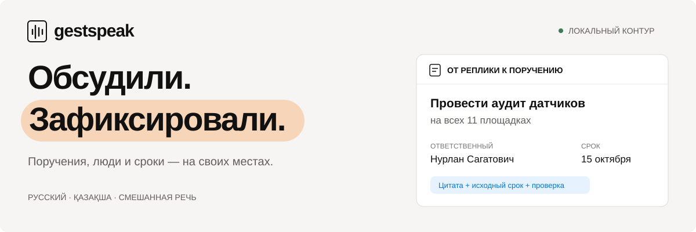
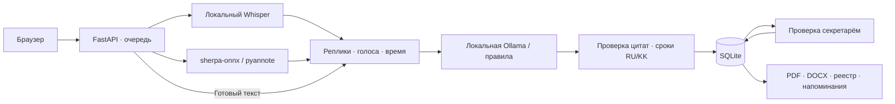

<p align="center">
  
</p>

# GestSpeak

### Обсудили. Зафиксировали. Выполнили.

**Локальный ассистент совещаний для кейса Самрук-Казына.** Превращает запись или транскрипт в протокол, поручения с ответственными и сроками, а затем помогает контролировать исполнение. Русский, қазақша и смешанная речь; аудио и текст остаются внутри организации.

[Быстрый запуск](#быстрый-запуск) · [Демо за 3 минуты](docs/DEMO.md) · [Установка моделей](docs/SETUP.md) · [API](docs/API.md) · [Результаты проверок](docs/VALIDATION.md)

---

## От разговора до исполнения

| 01 · Записать | 02 · Проверить | 03 · Исполнить |
|---|---|---|
| Загрузите запись, включите микрофон или вставьте транскрипт | Уточните имена, проверьте цитаты, ответственных и сроки | Скачайте PDF/DOCX и отслеживайте поручения в общем реестре |

**Поручение можно проверить по источнику.** У каждого действия сохраняются исходная цитата, ID реплик и произнесённый срок. Голосовой кластер и ответственный за поручение — отдельные сущности. Секретарь подтверждает результат перед исполнением.

## Быстрый запуск

**Нужно:** Node.js 22.13+, npm и Python 3.9+. Установка зависимостей требует интернета.

```bash
git clone https://github.com/BAITC-Hacks/hack-a7c30eea-gestspeak.git
cd hack-a7c30eea-gestspeak
bash scripts/setup.sh
bash scripts/start-local.sh
```

Откройте **http://127.0.0.1:8000** · документация API: **http://127.0.0.1:8000/docs**.

Повторный запуск: `bash scripts/start-local.sh`. Данные сохраняются в `data/`. Базовая установка включает текстовый сценарий, демо и экспорт; аудиомодели устанавливаются отдельно по [инструкции](docs/SETUP.md#облегчённый-cpu-профиль). На машине финальной проверки лёгкий аудиопрофиль установлен и запущен.

### Покажите жюри за 3 минуты

1. **Создайте результат через API:** «Новое совещание» → «Текст» → пример «Русский» → уведомление участников → «Сформировать протокол».
2. **Проверьте поручение:** откройте аудит датчиков; сравните цитаты и итоговый срок **15 октября** после обсуждения двух и трёх недель.
3. **Подтвердите исполнителя и срок:** сохраните поручение, переведите его в статус «В работе».
4. **Покажите контроль:** откройте реестр поручений и напоминания, скачайте **PDF** или **DOCX**.
5. **Покажите языки:** создайте встречу из [казахского](examples/kazakh.txt) или [смешанного](examples/mixed.txt) текста. Укажите дату встречи для расчёта относительных сроков.

Для мгновенного обзора доступен **«Открыть демопример»** с десятью заранее размеченными поручениями. Он явно помечен в интерфейсе и экспортах; это пример рабочего процесса, а не результат распознавания. Дата 23.09.2026 выбрана как база относительных сроков, поскольку в исходном кейсе дата заседания не указана.

## Возможности

| Возможность | Как реализована |
|---|---|
| Распознавание речи RU / KK / mixed | Локальный мультиязычный faster-whisper; качество зависит от выбранных весов |
| Диаризация | Локальная sherpa-onnx или pyannote; сопоставление голосовых интервалов словам по времени |
| Имена участников | Ручная привязка голосового кластера к человеку |
| Поручения и саммари | Локальная Ollama / Qwen2.5; при её отсутствии — явно обозначенный режим правил RU/KK/mixed |
| Проверка результата | Исходные реплики, цитаты, редактирование, подтверждение ответственного и срока |
| Контроль исполнения | Статусы, фильтры, реестр и внутренние напоминания за 3 дня и при просрочке |
| Документы | PDF со встроенным Noto Sans, DOCX и JSON; поддержка кириллицы и казахских символов |
| Аудио и видео | WAV, MP3, M4A, MP4, WEBM, OGG, FLAC, MOV; до 250 МБ и 2 часов; микрофон на localhost/HTTPS |
| Хранение и API | SQLite, журнал событий, удаление встречи, FastAPI / OpenAPI |
| Закрытый контур | Локальные веса и шрифты, отключённая телеметрия, изолированная runtime-сеть Docker |

## Что проверено

| Проверка | Фактический результат |
|---|---|
| Автоматические проверки | **33 различные проверки прошли:** 29 базовых и 4 дополнительных аудиопроверки |
| Интерфейс | TypeScript и производственная сборка выполнены; статический интерфейс отвечает HTTP 200 |
| Текст кейса → живой API | **10 поручений**, у каждого есть цитата и ID реплик; получены корректные PDF и DOCX |
| Локальный аудиопрогон | Синтетическая RU-запись **9,613 с** обработана Whisper tiny + sherpa-onnx за **33,70 с** |
| Развёртывание на Mac | Служба launchd, автозапуск, HTTP 200; ASR и диаризация доступны в `/api/health` |

**Границы результата.** Tiny ошибается: в техническом прогоне были неверное имя и «38 сентября». Качество казахского и смешанного ASR, двухголосой диаризации и LLM не измерено. Ollama на машине проверки не установлена, поэтому поручения извлекаются локальными правилами. Десять поручений на тексте кейса — проверка конкретного сценария, а не общая метрика точности.

GitHub Actions настроен, но runner заблокирован биллингом организации. Docker/GPU и браузерный визуальный прогон не проверены. Полный отчёт с командами и артефактами: **[VALIDATION.md](docs/VALIDATION.md)**.

## Архитектура



Сроки рассчитываются от даты встречи: «15 октября» использует её год, «к среде» — ближайшую среду с пометкой неоднозначности, «на следующей неделе» — рабочий интервал понедельник–пятница. Неизвестный срок остаётся пустым. Уточнения и смысловые выводы требуют проверки человеком.

| Каталог / модуль | Ответственность |
|---|---|
| [backend/gestspeak](backend/gestspeak) | API, ASR, диаризация, извлечение, SQLite и экспорт |
| [frontend/app](frontend/app) | Интерфейс совещаний, поручений и проверки |
| [backend/tests](backend/tests) | Даты, происхождение полей, API и документы |
| [examples](examples) | RU, KK, mixed и синтетические записи |
| [scripts](scripts) | Установка, модели, локальный запуск и служба macOS |

## Воспроизводимость

```bash
source .venv/bin/activate
pip install pytest==8.4.1 pypdf==5.9.0
PYTHONPATH=backend pytest backend/tests -q
cd frontend
npm run typecheck
npm run build
```

Тесты не измеряют WER/CER, DER или точность LLM. Для оценки нужны отдельные анонимизированные или синтетические записи с эталонными репликами, голосовыми интервалами, поручениями и сроками.

| Документ | Что внутри |
|---|---|
| [Демонстрация](docs/DEMO.md) | Сценарий защиты и последовательность действий |
| [Установка и модели](docs/SETUP.md) | CPU-профиль, полный AI-контур, Docker, GPU и автозапуск на Mac |
| [API](docs/API.md) | Запросы, асинхронная обработка, экспорт и ошибки |
| [Проверки](docs/VALIDATION.md) | Фактические результаты и ограничения |
| [Безопасность](docs/SECURITY.md) | Локальная обработка, доступ, хранение и границы прототипа |

## Ценность для заказчика

Секретарь получает черновик с проверяемыми источниками. Руководитель видит **что сделать, кто отвечает и когда срок**. История встречи, поручения и документы находятся в одном рабочем пространстве.

| Критерий хакатона | Что можно показать |
|---|---|
| Работоспособность · 25 | Путь от записи/текста до подтверждённого поручения и документа |
| Техническая реализация · 25 | Локальные модели, очередь, источники, календарные правила, API |
| README и воспроизводимость · 25 | Скрипты, примеры, подготовка весов, Docker и отчёт проверок |
| Ценность · 15 | Проверка секретарём, ответственные, сроки и контроль исполнения |
| Потенциал · 10 | JSON для СЭД, независимые AI-адаптеры, проверяемость результата |

Баллы в таблице — веса организатора. Следующие этапы: измерение качества на данных заказчика, адаптер СЭД, уведомления, роли доступа и масштабирование очереди. Бот-участник Teams/Zoom/Meet, потоковая транскрипция, email, промышленная СЭД, SSO/RBAC и биометрическая идентификация пока не реализованы; записи платформ можно загрузить файлом.

## Приватность и лицензии

Аудио и текст не отправляются во внешние облачные AI API. OpenAI/NVIDIA hosted API не используются: это ограничение кейса. NVIDIA GPU и TitaNet доступны в локальной конфигурации. Веса подготавливаются отдельно; при отсутствии моделей приложение сообщает об этом, сохраняя данные локально.

Базовый режим рассчитан на одного доверенного пользователя на localhost. Для сети нужны `GESTSPEAK_API_TOKEN`, внутренний TLS reverse proxy и точный список `GESTSPEAK_ALLOWED_ORIGINS`; подробности в [SECURITY.md](docs/SECURITY.md). Записи, база, `.env` и веса исключены из Git.

Код — [MIT](LICENSE). Библиотеки и модели сохраняют собственные лицензии; Noto Sans — [SIL OFL](assets/fonts/OFL.txt), pyannote требует принятия условий модели. GestSpeak не аффилирован с Notion или OpenAI.
