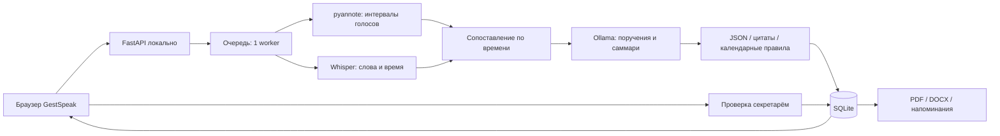

# GestSpeak

**Совещание → транскрипт → проверяемые поручения → контроль исполнения.**

Прототип для кейса Самрук-Казына. Русский, казахский и смешанная речь обрабатываются локальными моделями. Интерфейс в стиле бумажного рабочего пространства: тёплый фон, белые карточки, один синий акцент.

## Для жюри — за 3 минуты

1. Запустите приложение по инструкции ниже и откройте **http://localhost:3000**.
2. Нажмите **«Открыть демопример»**: две темы, пять говорящих, десять поручений.
3. В поручении аудита откройте исходные реплики: первоначальные две недели заменены согласованным **15 октября**.
4. Проверьте исполнителя и дату, подтвердите поручение, измените статус. Обновите страницу: результат сохранён.
5. Скачайте **PDF и DOCX**, откройте реестр поручений и напоминания.
6. Для независимой проверки вставьте `examples/kazakh.txt` или `examples/mixed.txt` в новое совещание.

**Что уже проверено:** 17 unit/API-тестов, TypeScript, production-сборка, HTTP 200, живой цикл создания/обработки/удаления двух текстовых совещаний. [Подробный отчёт](docs/VALIDATION.md).

**Граница демонстрации:** пример с десятью поручениями размечен заранее и явно помечен в продукте. Полный аудиосценарий реализован через локальные адаптеры Whisper + pyannote + Ollama, но требует установки весов; распознавание и качество моделей на аудио в этой среде не проверены. Без Ollama приложение показывает ограниченный режим явных текстовых поручений по правилам. Вымышленные метрики качества не приводятся.

**Навигация:** [запуск](#быстрый-запуск) · [возможности](#реализованные-возможности-и-границы) · [модели](#локальные-модели) · [архитектура](#архитектура) · [тесты](#тесты) · [безопасность](docs/SECURITY.md) · [защита](docs/DEMO.md).

## Быстрый запуск

Требования: Node.js **22.13+**, Python **3.11** рекомендуется (базовый сервер также совместим с 3.9), npm. Интернет нужен только при установке зависимостей и подготовке моделей.

```bash
git clone https://github.com/BAITC-Hacks/hack-a7c30eea-gestspeak.git
cd hack-a7c30eea-gestspeak
cp .env.example .env
bash scripts/dev.sh
```

Откройте **http://localhost:3000**. API: http://127.0.0.1:8000/docs.

На первом запуске сервер добавляет размеченный пример химической промышленности и техники безопасности. Он помечен как демонстрационный в интерфейсе и экспортах. Дата **23.09.2026** — явно выбранная демонстрационная база относительных сроков; исходный кейс не задаёт год и дату заседания.

Если порт занят, остановите старую копию приложения. Скрипт не завершает чужие процессы. Данные сохраняются в `data/`; обновление страницы и перезапуск приложения не сбрасывают статусы.

### По шагам

1. Открыть демопример → вкладка «Поручения» → выбрать аудит датчиков.
2. Открыть цитаты: первоначальные две недели заменены согласованным 15 октября.
3. Проверить ответственного и срок, нажать «Подтвердить».
4. Изменить статус на «В работе» или «Выполнено», проверить реестр и напоминания.
5. Скачать PDF/DOCX с кириллицей, казахскими символами, цитатами и транскриптом.
6. В «Новом совещании» вставить текст из `examples/kazakh.txt` или `examples/mixed.txt`. Подтвердить уведомление участников, выбрать настоящую дату совещания.
7. После установки моделей загрузить аудио или записать разговор через микрофон. Доступ к микрофону работает на localhost или HTTPS. Запись обрабатывается **после остановки**, потоковая транскрипция пока не реализована.

## Реализованные возможности и границы

| Возможность | Реализация |
|---|---|
| Аудио/видео | Загрузка WAV, MP3, M4A, MP4, WEBM, OGG, FLAC, MOV; до 250 МБ и 2 часов |
| Русский / қазақша / смешанная речь | Адаптер faster-whisper, мультиязычный режим и выбор RU/KK; требует локальных весов и проверки качества на целевых записях |
| Различение говорящих | Локальная pyannote community-1; сопоставление слов и голосовых интервалов по пересечению времени |
| Привязка голоса к человеку | Ручное подтверждение имени кластера SPEAKER в интерфейсе; автоматическая биометрическая идентификация не заявлена |
| Поручения и саммари | Qwen2.5 через локальную Ollama, JSON Schema; обращения, уточнения сроков и повторение итогов описаны в системной инструкции |
| Проверяемость | Цитата, ID исходных реплик, проверка наличия цитат, ответственного и формулировки срока |
| Даты | Детерминированные правила RU/KK; год от даты встречи, периоды рабочей недели и неоднозначности видны человеку |
| Проверка | Редактирование поручения, исполнителя и срока, утверждение секретарём; все новые результаты — черновики |
| Экспорт | Настоящие PDF/DOCX, встроенный шрифт Noto Sans в PDF, переносы строк, повтор заголовка таблицы |
| Исполнение | Статусы, фильтры по ответственному/сроку/проверке, внутренние напоминания за 3 дня и при просрочке |
| Данные | SQLite, локальное аудио, журнал типов событий; удаление совещания и записей |
| Закрытый контур | Offline загрузка весов, запрет публичного URL LLM, отключённая телеметрия, внутренний Docker network |
| Teams / Zoom / Google Meet | Загрузка записей из платформ. Бот-участник не реализован |
| СЭД / email / SSO | Не реализованы; точки расширения — JSON API и экспорт |

## Локальные модели

Основы решения — открытые репозитории:

- [SYSTRAN/faster-whisper](https://github.com/SYSTRAN/faster-whisper) — распознавание речи с CTranslate2, CPU/GPU.
- [pyannote/pyannote-audio](https://github.com/pyannote/pyannote-audio) и [speaker-diarization-community-1](https://huggingface.co/pyannote/speaker-diarization-community-1) — локальные голосовые кластеры.
- [ollama/ollama](https://github.com/ollama/ollama) и [Qwen2.5](https://ollama.com/library/qwen2.5) — локальная языковая модель; API вызывается с JSON Schema.

### 1. Подготовка на машине с интернетом

Не используйте реальные записи на этом этапе. Подготовьте среду Python 3.11 и свободное место для нескольких гигабайт весов. Полный набор large-v3, pyannote, Qwen и PyTorch требует существенно больше места, чем базовое приложение.

```bash
python3.11 -m venv .venv
source .venv/bin/activate
pip install -r backend/requirements.txt -r backend/requirements-ai.txt
pip install huggingface_hub==0.34.4
python scripts/prepare-models.py
```

Для pyannote сначала самостоятельно примите условия на странице модели. Используйте личный HF token **только для скачивания** (не коммитьте его):

```bash
# HF_TOKEN задаётся через защищённое окружение, не в коде и не в README.
python scripts/prepare-models.py --include-diarization
```

Папка `models/diarization` должна содержать настоящий `config.yaml` и веса, не указатели Git LFS. Скрипт использует snapshot_download. `models/whisper` должна содержать `model.bin`, tokenizer и конфигурацию. Для проб на слабом CPU можно отдельно скачать `--whisper Systran/faster-whisper-small`; это компромисс качества, особенно казахского, а не эквивалент large-v3.

Установите Ollama по инструкции её репозитория, затем:

```bash
ollama serve
# в другом терминале
ollama pull qwen2.5:7b
```

### 2. Изолированный runtime

Перенесите подготовленные зависимости, веса и модель Ollama внутрь контура. Проверьте `.env`:

```dotenv
OLLAMA_URL=http://127.0.0.1:11434
OLLAMA_MODEL=qwen2.5:7b
WHISPER_MODEL_PATH=models/whisper
DIARIZATION_MODEL_PATH=models/diarization
AI_DEVICE=cpu
WHISPER_COMPUTE=int8
```

Для NVIDIA используйте совместимые версии CUDA/cuDNN по документации faster-whisper, `AI_DEVICE=cuda`, `WHISPER_COMPUTE=float16`. GPU профиль необходимо проверить на целевом оборудовании; CPU остаётся базовым путём.

В runtime `HF_HUB_OFFLINE=1`, `TRANSFORMERS_OFFLINE=1`, `PYANNOTE_METRICS_ENABLED=0`. Whisper получает `local_files_only=True`. Приложение **не скачивает модели при загрузке совещания**. Отсутствие модели приводит к понятной ошибке, а не к внешнему API или подстановке деморезультата.

Откройте «Система» и проверьте все три компонента. Статус подтверждает наличие файлов/пакетов и доступность модели Ollama, но не заменяет полный прогон записи. После изменения имени говорящего можно повторить анализ; интерфейс предупреждает о замене поручений и статусов.

## Архитектура



`backend/gestspeak/engine.py` — адаптеры AI и проверка происхождения полей.
`dates.py` — правила сроков без доверия календарным догадкам LLM.
`main.py` — API, очередь, операции с поручениями, происхождение и экспорт.
`store.py` — SQLite и события. `exports.py` — документы.
`frontend/app/page.tsx` — интерфейс и работа с API; `globals.css` — токены Notion-референса.

### Принцип ответственности

Диаризация выдаёт **кто говорил**, анализ поручений — **кому поручили**. Это разные поля. При отсутствии имени исполнитель остаётся неопределённым. LLM не разрешено сочинять фамилии; backend удаляет неподтверждённые имена. Даже подтверждённая цитата не гарантирует семантическую правильность: человек проверяет результат.

### Даты

- «15 октября» → год совещания; необходимость проверить год обозначена.
- «К среде» → ближайшая среда, включая день совещания; всегда пометка неоднозначности.
- «На следующей неделе» → интервал понедельник–пятница; видны начало и конец, требуется подтверждение.
- Неизвестный срок → `null`, а не произвольная дата.
- Уточнения вроде «две недели… три недели… к 15 октября» должен разрешить LLM, указав все исходные реплики. В демо это ручная эталонная разметка, в тестах проверяется хранение финального результата, а не качество LLM.

## Тесты

```bash
source .venv/bin/activate
pip install pytest==8.4.1 pypdf==5.9.0
PYTHONPATH=backend pytest backend/tests -q
cd frontend
npm run typecheck
npm run build
```

Проверяются RU/KK даты, неизвестные сроки, защита от неподтверждённого исполнителя и цитаты, запрет публичного AI endpoint, границы говорящих, реальные форматы экспорта и казахские символы, сохранение статусов, согласие, Origin и token auth. Эти unit/API-тесты **не измеряют** качество распознавания аудио, DER, recall контекстных поручений или способность модели понимать казахский.

Для честной оценки: предоставьте свои анонимизированные RU/KK/mixed записи, эталонные слова, интервалы голосов и поручения. Измерьте WER/CER, DER, F1 поручений, точность исполнителя и даты. Не используйте заранее размеченный демопример как доказательство качества моделей.

## API

| Метод | Путь | Назначение |
|---|---|---|
| GET | `/api/health` | Состояние моделей |
| GET | `/api/meetings` | Совещания |
| POST | `/api/meetings/text` | Текст и дата совещания |
| POST | `/api/meetings/audio` | multipart загрузка |
| PATCH | `/api/meetings/{id}/actions/{aid}` | Изменение / проверка поручения |
| PATCH | `/api/meetings/{id}/speakers` | Сопоставление голоса и имени |
| POST | `/api/meetings/{id}/reanalyze` | Повторная обработка транскрипта |
| GET | `/api/meetings/{id}/export/pdf` | PDF |
| GET | `/api/meetings/{id}/export/docx` | DOCX |
| GET | `/api/meetings/{id}/export/json` | JSON для будущей СЭД |
| GET | `/api/reminders` | Просрочено / срок в течение 3 дней |
| DELETE | `/api/meetings/{id}` | Удалить запись и протокол |

## Развёртывание и приватность

Базовый запуск привязан к loopback и одному доверенному пользователю. При сетевом доступе задайте `GESTSPEAK_API_TOKEN`, внутренний TLS reverse proxy и ограничения Origin. Токен вводится в интерфейсе и хранится в памяти вкладки. Публичный сервис без дополнительной аутентификации/RBAC не предполагается.

```bash
# Сервер без AI зависимостей (демо и текстовые правила)
docker compose up --build api
# Полный набор зависимостей, заранее смонтированные модели и заполненный volume Ollama
WITH_AI=1 docker compose --profile ai up --build
```

Compose намеренно использует `internal: true`: скачивание моделей из контейнера runtime не сработает. Подготовьте volume Ollama и веса на сетевом этапе, затем запустите изолированный профиль. Docker-образ и GPU-профиль требуется отдельно проверить на целевом сервере. Подробнее: [границы безопасности](docs/SECURITY.md).

Загружаемые файлы, база, веса и `.env` исключены из Git. Записи не отправляются в сторонние AI API, аналитику или CDN. Шрифт интерфейса/экспорта размещён локально. Логи ошибок не содержат транскрипт, однако текст ошибки стороннего декодера может содержать имя локального файла.

## Соответствие критериям хакатона

| Критерий | Что представлено в репозитории |
|---|---|
| Работоспособность — 25 | Сквозной сценарий загрузки/текста, очередь обработки, проверка поручений, реестр, экспорт; AI-адаптеры требуют локальных моделей |
| Техническая реализация — 25 | Отдельные адаптеры ASR/диаризации/LLM, JSON Schema, проверка цитат, календарные правила, SQLite и тесты |
| README и воспроизводимость — 25 | Быстрый запуск, зафиксированные зависимости, Dockerfile, подготовка моделей, API, примеры RU/KK/mixed и CI |
| Ценность — 15 | Ответственный и срок не теряются; спорные данные проверяет секретарь; статусы и напоминания помогают контролировать исполнение |
| Развитие и оригинальность — 10 | Проверяемость каждого поручения по репликам; различение говорящего и исполнителя; закрытый контур и JSON для будущей СЭД |

Числа в таблице — веса критериев организатора, **не присвоенные проекту баллы**.

## Для защиты

[Сценарий демонстрации на 4 минуты](docs/DEMO.md). Отличительная идея — **проверяемое поручение**: цитата + участник + исходная формулировка срока + календарное правило + решение секретаря. Контроль исполнения начинается только после осмысленной проверки, а не по догадке модели.

## Лицензии

Код проекта: MIT, см. [LICENSE](LICENSE). Библиотеки и модели сохраняют собственные лицензии. Noto Sans — SIL Open Font License, текст в `assets/fonts/OFL.txt`. Для pyannote необходимы принятие условий доступа и соблюдение CC BY 4.0. Проект не связан с Notion или OpenAI; их фирменные логотипы не используются.

### Собранный интерфейс без Node.js в runtime

```bash
cd frontend
npm ci
npm run build
cd ..
PYTHONPATH=backend .venv/bin/python -m uvicorn gestspeak.main:app --host 127.0.0.1 --port 8000
```

Откройте http://127.0.0.1:8000. FastAPI обслуживает статическую сборку и API с одного origin. Dockerfile делает эту сборку отдельным этапом; рабочему контейнеру Node.js не нужен.

После первой установки и сборки повторный запуск без переустановки зависимостей:

```bash
bash scripts/start-local.sh
```

Адрес собранной версии: **http://127.0.0.1:8000**. При уже работающем сервере достаточно открыть этот адрес; второй экземпляр запускать не нужно.
